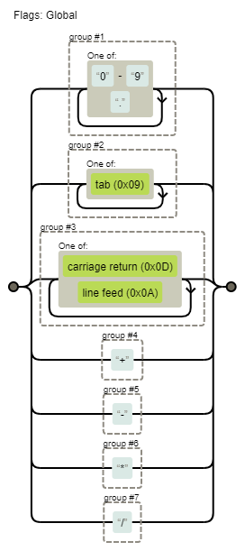

<!--
 * @Author: songyzh
 * @Date: 2021-01-07 10:45:38
 * @LastEditors: songyzh
 * @LastEditTime: 2021-01-07 14:40:23
-->

# 编译原理

编译原理，作为一门基础理论学科，除了 JS 语言本身的编译器之外，更成为 Babel、ESLint、Stylus、Flow、Pug、YAML、Vue、React、Marked 等开源前端框架的理论基石之一。

众所周知`Javascript`被归类为"动态"或"解释型"语言,但是事实上它是一门编译语言，但是与传统编译语言不同，它不是提前编译的，编译结果也不能在分布式系统中进行移植，尽管如此，`Javascript`引擎进行编译的步骤和传统的编译语言非常相似。


## 编译器

代码本质上是结构化的文本，这些文本最终都需要被翻译成为机器语言被计算机识别，这个过程就是编译器来完成的。对外部来说，编译器是一个黑盒子，能够把一种源语言翻译为语义上等价的另一种目标语言。从现代高级编译器的角度讲，源语言是高级程序设计语言，容易阅读与编写，而目标语言是机器语言，即二进制代码，能够被计算机直接识别。

## 分词/词法分析（Tokenizing/Lexing）

> 词法分析（英语：lexical analysis）是计算机科学中将字符序列转换为标记（token）序列的过程。 进行词法分析的程序或者函数叫作词法分析器（lexical analyzer，简称 lexer），也叫扫描器（scanner）。--维基百科

词法分析是处理源程序的第一部分，主要任务是逐个扫描输入字符，转换为词法单元（token）序列，传递给语法分析器进行语法分析。token 是一个不可分割的最小单元。在词法分析器里，每个关键字是一个 token ，每个标识符是一个 token，每个操作符是一个 token，每个标点符号也都是一个 token。除此之外，还会过滤掉源程序中的注释和空白字符（换行符、空格、制表符等）。

## 解析/语法分析（Parsing）

> 语法分析（英语：syntactic analysis，也叫 parsing）是根据某种给定的形式文法对由单词序列（如英语单词序列）构成的输入文本进行分析并确定其语法结构的一种过程。 --维基百科

语法分析是词法分析的下一步，主要任务是扫描来自词法分析器产生的 token 序列，根据文法和结点类型定义构造出一棵 AST，传递给编译器前端余下部分。文法描述了程序设计语言的构造规则，它定义了哪些符号串是合法句子，用于指导整个语法分析的过程。它由四个部分组成，一组终结符号（也称 token）、一组非终结符号、一组产生式和一个开始符号。

根据文法，语法分析器将 token 逐个读入，不断替换文法产生式体的非终结符号，直至全部将非终结符号替换为终结符号，这个过程被称为推导。推导又分为两种方式，最左推导和最右推导。如果总是优先替换产生式体最左侧的非终结符号，被称为最左推导，如果总是优先替换产生式体最右侧的非终结符号，被称为最右推导。

语法分析器按照工作方式来划分，分为自顶向下分析法和自底向上分析法。自顶向下分析法要求通过最左推导从顶部 ( 根结点 ) 开始构造 AST，常用的分析器有递归下降语法分析器、 LL 语法分析器。而自底向上分析法要求通过最右推导从底部 ( 叶子结点 ) 开始构造 AST，常用的分析器有 LR 语法分析器、SLR 语法分析器、LALR 语法分析器。

## 代码生成

任何语言的执行都要经过编译前端的这一过程，在 AST 构造前的阶段大体上都大同小异，但是到目标代码生成阶段，不同类型的语言有着不一样的处理方式。`Javascript`会根据其 js 引擎的不同，生成不同的目标代码(字节码或机器代码)

## 四则运算例子

按照编译原理相关的知识，对四则运算的编译可以分成几个步骤：

- 定义四则运算：产出四则运算的词法定义和语法定义。
- 词法分析：把输入的字符串流变成 token。
- 语法分析：把 token 变成抽象语法树 AST。
- 解释执行：后序遍历 AST，执行得出结果。

### 定义四则运算

四则运算就是加减乘除四种运算，例如：

```javascript
1 + 2 * 3;
```

#### 定义词法

四则运算里面只有数字和运算符，所以定义很简单，但是还要注意空格和换行符，所以词法定义大概是下面这样的。

- Token:
  - Number: 1 2 3 4 5 6 7 8 9 0 的组合
  - Operator: + 、-、 \*、 / 之一
- Whitespace: <sp>
- LineTerminator：<LF> <CR>

#### 定义语法

语法定义多数采用 BNF， JavaScript 标准里面是一种跟 BNF 类似的自创语法。语法定义的核心思想不会变，都是几种结构的组合产生一个新的结构，所以语法定义也叫语法产生式。

加减乘除有优先级，所以可以认为加法是由若干个乘法再由加号或者减号连接成的：

```xml
// 四则定义

<Expression> ::=
    <AdditiveExpression><EOF>

// 加法定义
<AdditiveExpression> ::=
    <MultiplicativeExpression>
    |<AdditiveExpression><+><MultiplicativeExpression>
    |<AdditiveExpression><-><MultiplicativeExpression>
```

这种 BNF 的写法类似递归的原理。为了方便，把普通数字也得当成乘法的一种特例

```xml
// 乘法定义
<MultiplicativeExpression> ::=
    <Number>
    |<MultiplicativeExpression><*><Number>
    |<MultiplicativeExpression></><Number>
```

### 词法分析

词法分析部分，把字符流变成 token 流。词法分析有两种方案，一种是状态机，一种是正则表达式。对于四则运算可以采用正则方式进行匹配拆分出符合词法定义的 token 数组

```javascript
let reg = /([0-9\.]+)|([\r]+)|([\r\n]+)|(\+)|(\-)|(\*)|(\/)/g;
```



借助这个正则就可以把四则运算表达式解析为 token 数组，比如`1024 + 2 * 256`就可以解析为

```
1024
+
2
*
256
```

最终生成 token 数组

```javascript
[
  { type: "Number", value: "1024" },
  { type: "+", value: "+" },
  { type: "Number", value: "2" },
  { type: "*", value: "*" },
  { type: "Number", value: "256" },
  { type: "EOF" },
];
```

### 语法分析（LL）

LL 语法分析会递归下降分析，每次向前查看一个输入 token，来决定该用哪种产生式展开。根据产生式的非终结符号从左到右的顺序，依次构造它的子结点，不断递归下降分析，直至所有 token 读入完毕。最后生成的一棵 AST。

### 解释执行

得到了 AST 之后就进入执行阶段。只需要对这个树做遍历操作执行即可。根据不同的节点类型和其它信息，写 if 分别处理即可。
