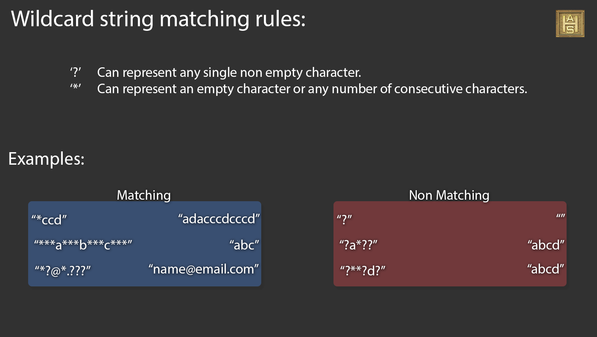

<!--
 * @Author: songyzh
 * @Date: 2020-12-21 15:35:43
 * @LastEditors: songyzh
 * @LastEditTime: 2021-01-14 17:20:05
-->

# 学习笔记

## 字典树（Trie）

> 在计算机科学中，trie，又称前缀树或字典树，是一种有序树，用于保存关联数组，其中的键通常是字符串。与二叉查找树不同，键不是直接保存在节点中，而是由节点在树中的位置决定。一个节点的所有子孙都有相同的前缀，也就是这个节点对应的字符串，而根节点对应空字符串。一般情况下，不是所有的节点都有对应的值，只有叶子节点和部分内部节点所对应的键才有相关的值。 —— 维基百科

它是一种哈希树的变种。利用字符串的公共前缀来减少查询时间，最大限度地减少无谓的字符串的查询。
Trie 树包含以下特征：

- 根节点不包含字符，除根节点外的每一个子节点都包含一个字符。
- 从根节点到某一节点，路径上经过的字符连接起来，就是该节点对应的字符串
- 每个单词的公共前缀作为一个字符节点保存。

  

  在上图示例中，在节点中标记的值是该节点对应表示的字符串。例如从根节点开始，选择第二条路径 'b'，然后选择它的第一个子节点 'a'，接下来继续选择子节点 'd'，我们最终会到达叶节点 "bad"。节点的值是由从根节点开始，与其经过的路径中的字符按顺序形成的。

值得注意的是，根节点表示 空字符串 。

前缀树的一个重要的特性是，节点所有的后代都与该节点相关的字符串有着共同的前缀。这就是 前缀树 名称的由来。

例如，以节点 "b" 为根的子树中的节点表示的字符串，都具有共同的前缀 "b"。反之亦然，具有公共前缀 "b" 的字符串，全部位于以 "b" 为根的子树中，并且具有不同前缀的字符串来自不同的分支。

前缀树有着广泛的应用，典型应用是统计、自动补全，拼写检查,排序和保存大量的字符串（但不仅限于字符串），所以经常被搜索引擎系统用于文本词频统计。

## KMP 算法

给定两个字符串 `S`和`T`, 在主串`S`中查找字串`T`的过程称为**字符串匹配**问题，T 称为**模式串**。

最容易想到的算法就是 `BF(Brute Force)算法`,逐个匹配主串与模式串的字符如果相等则比较两者下一位字符，如果不想等，则模式串回溯到第一位，主串下移一位进行新一轮比较,循环往复。


但是 `BF 算法`的缺点很明显，效率实在太低，每一轮只能老老实实地把模式串右移一位，实际上做了很多无谓的比较

> 实际上像 KMP，BM 这些高级算法的会有预处理时间和会消耗一些空间，在处理一些不是非常大的字符串的时候，时间不会有太大优势，而且还会占用一些空间，所以很多字符串匹配库还是会用 BF 算法

为了解决`BF`算法的效率问题，三位科学家发明了一种算法`Knuth-Morris-Pratt算法（简称KMP）`,它以三个发明者命名。

### KMP 原理

`KMP`算法能够避免无谓的比较，实现每一轮比较能够让模式串尽量多移动几位，关键点在于**已匹配的前缀**。
`KMP 算法`和` BF 算法`的“开局”是一样的，同样是把主串和模式串的首位对齐，从左到右对逐个字符进行比较。

第一轮，模式串和主串的第一个等长子串比较，发现前 5 个字符都是匹配的，第 6 个字符不匹配，是一个“坏字符”,这时候，如何有效利用已匹配的前缀 “ABBAB” 呢？可以发现，在前缀“ABBAB”当中，后两个字符“AB”和前两位字符“AB”是相同的：


在下一轮的比较时，只有把这两个相同的片段对齐，才有可能出现匹配。这两个字符串片段，分别叫做**最长可匹配后缀子串**和**最长可匹配前缀子串**.

。

把步骤拆解来看可以解释为什么**两个相同的片段对齐，才有可能出现匹配**

。

通过上面的分析可以知道，如果找到了模式串中不匹配的字符就可以在这个字符前面找**最长可匹配后缀子串**和**最长可匹配前缀子串**,然后让前缀移动到后缀位置。继续下一轮比较。


所以`KMP算法`关键点在于找到**最长可匹配后缀子串**和**最长可匹配前缀子串** 。


然后移动，使得公共前缀移动到后缀的位置,然后继续比较。


最终完成匹配。

### next 数组

通过上面的原理分析，可以知道 KMP 的核心在于找到一个字符串的**最长可匹配后缀子串**和**最长可匹配前缀子串**,对于这个问题，可以事先用一个数组把相关信息存储起来，等用的时候直接去数组里面取，这个数组被称为`next`数组。`next数组`是一个一维整型数组，数组的下标代表了“已匹配前缀的下一个位置”，元素的值则是“最长可匹配前缀子串的下一个位置”。 那`next数组`是如何生成的呢。
"部分匹配值"就是"前缀"和"后缀"的最长的共有元素的长度。以"ABCDABD"为例，

```
　　－　"A"的前缀和后缀都为空集，共有元素的长度为0；

　　－　"AB"的前缀为[A]，后缀为[B]，共有元素的长度为0；

　　－　"ABC"的前缀为[A, AB]，后缀为[BC, C]，共有元素的长度0；

　　－　"ABCD"的前缀为[A, AB, ABC]，后缀为[BCD, CD, D]，共有元素的长度为0；

　　－　"ABCDA"的前缀为[A, AB, ABC, ABCD]，后缀为[BCDA, CDA, DA, A]，共有元素为"A"，长度为1；

　　－　"ABCDAB"的前缀为[A, AB, ABC, ABCD, ABCDA]，后缀为[BCDAB, CDAB, DAB, AB, B]，共有元素为"AB"，长度为2；

　　－　"ABCDABD"的前缀为[A, AB, ABC, ABCD, ABCDA, ABCDAB]，后缀为[BCDABD, CDABD, DABD, ABD, BD, D]，共有元素的长度为0。
```

按这个方法计算最终可以得到 next 数组，即如果此时模式串走到"A<span style="color:red">B</span>CDABD"中的 B 那么前面只有字母 A 则根据上面的分析在 B 处填入 0,同理如果走到"ABCDA<span style="color:red">B</span>D"那么前面字符串为"ABCDA"那么根据上面分析则此处填入 1,由此得到 next 数组
最终生成 next 数组`[0,0,0,0,0,1,2]`

### 整体逻辑

- 对模式串预处理，生成 next 数组

- 进入主循环，遍历主串
  - 比较主串和模式串的字符
  - 如果发现坏字符，查询 next 数组，得到匹配前缀所对应的最长可匹配前缀子串，移动模式串到对应位置
  - 如果当前字符匹配，继续循环

## WildCard




## 查缺补漏

### fromCharCode

`fromCharCode` 可接受一个指定的 Unicode 值，然后返回一个字符串。该方法是 String 的静态方法，字符串中的每个字符都由单独的 Unicode 数字编码指定。使用语法：` String.fromCharCode()`。

```javascript
var n = String.fromCharCode(72, 69, 76, 76, 79); //HELLO
```

### Symbol

由于 Symbol 的设计初衷是为了避免冲突，当遍历 JavaScript 对象时，并不会枚举到以 Symbol 作为建的属性，比如，for-in 循环只会遍历到以字符串作为键的属性，Object.keys(obj)和 Object.getOwnPropertyNames(obj) 也一样，但这并不意味着 Symbol 为键的属性是不可枚举的：使用 Object.getOwnPropertySymbols(obj) 这个新方法可以枚举出来，还有 Reflect.ownKeys(obj) 这个新方法可以返回对象中所有字符串和 Symbol 键。
